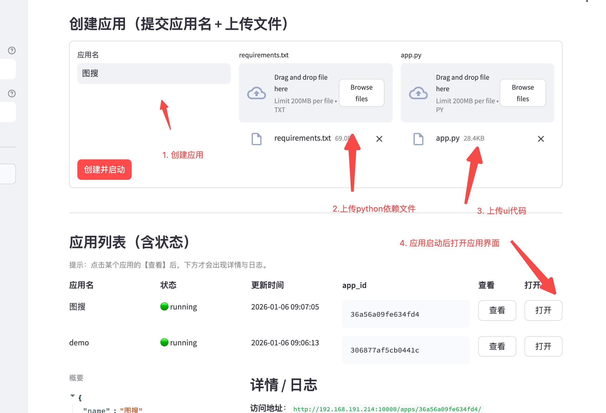
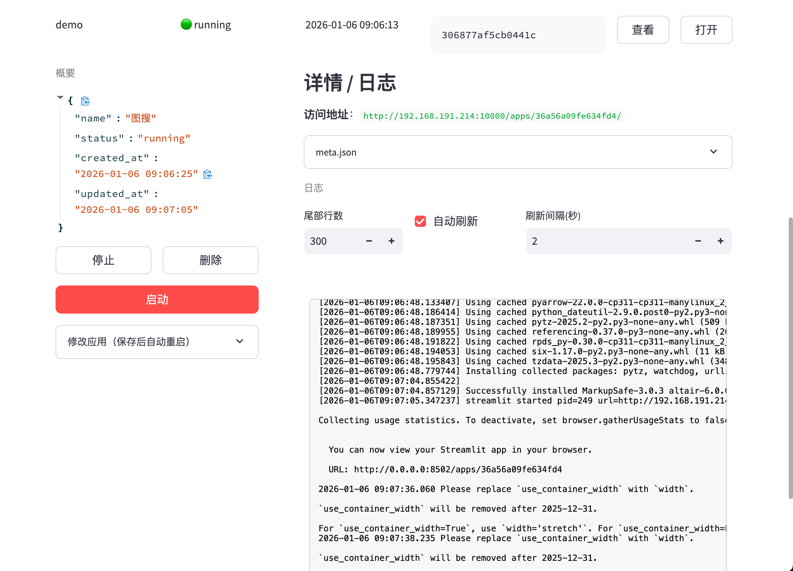

## corpApps

`corpApps` is a Streamlit app hosting platform for **private/internal deployments**. It consolidates the **Admin Console / API / hosted apps** behind a **single public port** (default: `8080`). You can upload `app.py` + `requirements.txt` in the console to create/start/update Streamlit apps, with status tracking and logs.

- Chinese README: `README.zh-CN.md`
- Feishu manual (ZH): `docs/feishu_manual_zh.md`

- **Admin console (Streamlit)**: create/start/stop/edit apps, view logs (via `/console/`)
- **Hosted apps (Streamlit)**: one directory + one venv per app, auto-install dependencies and run (via `/apps/<app_id>/`)
- **API (FastAPI)**: app lifecycle management + reverse proxy (via `/api/*`)
- **Single public port**: only one external entrypoint; internal ports (console `8500`, apps `85xx`) are not exposed

> **Security note**: this system executes user-uploaded Python code. Use it only in trusted private environments, and harden it with container isolation, network policies, and resource limits.

### Endpoints (single public port)

Assume the public entry is `PUBLIC_BASE=http://<host>:<port>`:

- **Console**: `PUBLIC_BASE/console/`
- **API**: `PUBLIC_BASE/api`
- **Apps**: `PUBLIC_BASE/apps/<app_id>/`

### Quick start (Docker, recommended)

Run in the project root:

```bash
docker compose up -d --build
```

Open the console:

- `http://127.0.0.1:8080/console/`

### Quick start (local run, no Docker)

```bash
python -m venv .venv
source .venv/bin/activate
pip install -r requirements.txt
python -m streamlit_host.run_all
```

Default data directory is `./data` (override via `STREAMLIT_HOST_DATA`).

### Configure public port / domain (change one thing)

All generated links (console “Open” button, logs `url=...`, API `access_url`) are based on **`STREAMLIT_HOST_PUBLIC_BASE`**.

This repo provides `env.example`. Recommended: copy it to `.env`:

```bash
cp env.example .env
```

Typically you only need to change:

- **`HOST_PORT`**: public port on the host (host port → container `8080`)
- **`STREAMLIT_HOST_PUBLIC_BASE`**: external base URL (domain + optional port)

Example: expose `18080`:

- `HOST_PORT=18080`
- `STREAMLIT_HOST_PUBLIC_BASE=http://127.0.0.1:18080`

Then restart:

```bash
docker compose up -d --build
```

### Usage (via the console)



1) **Open the console**

- `PUBLIC_BASE/console/`

2) **Create an app**

- Enter an app name
- Upload `requirements.txt` and `app.py`
- After creation, the console shows: `PUBLIC_BASE/apps/<app_id>/`

3) **Start / stop**

- Click **View** in the app list to open details
- Use **Start** / **Stop** to control the process

4) **View logs**

- In the app details page, view `run.log` (supports auto-refresh and auto-scroll)



5) **Edit and restart**

- Upload a new `app.py` / `requirements.txt` or update the app name
- Saving triggers an automatic restart (dependencies re-installed in background)

### API (brief)

All endpoints are under `/api`:

- **`GET /api/apps`**: list apps
- **`POST /api/apps`**: create app (`multipart/form-data`: `name`, `requirements`, `app`)
- **`GET /api/apps/{app_id}`**: get app status
- **`PATCH /api/apps/{app_id}`**: update app (`name`/`requirements`/`app`), auto-restart
- **`POST /api/apps/{app_id}/start`**: start
- **`POST /api/apps/{app_id}/stop`**: stop
- **`GET /api/apps/{app_id}/logs?tail=200`**: tail logs
- **`DELETE /api/apps/{app_id}`**: delete

Create an app example (using the built-in `demo_app`):

```bash
curl -sS -X POST "http://localhost:8080/api/apps" \
  -F "name=demo" \
  -F "requirements=@demo_app/requirements.txt" \
  -F "app=@demo_app/app.py"
```

### Project layout (core)

- **`streamlit_host/`**: platform service (FastAPI entry, admin console, reverse proxy, app manager)
- **`demo_app/`**: a sample Streamlit app to validate the hosting flow
- **`data/`**: runtime data (app files, venv, logs, metadata; mounted to `/data` in Docker)
- **`assets/`**: README screenshots

### On-disk storage format

By default: `./data/apps/<app_id>/`:

- `app.py`
- `requirements.txt`
- `venv/`: per-app virtual environment
- `run.log`: install/start/stop logs
- `meta.json`: status, port, pid, name, error, etc.

### FAQ / Troubleshooting

- **Console shows blank page or assets fail to load**
  - Ensure you are using `PUBLIC_BASE/console/` (the trailing `/` is more reliable)
  - If deployed behind a reverse proxy / domain, set `STREAMLIT_HOST_PUBLIC_BASE` to the final external URL (including `https`, domain, and port if any)

- **App stuck in `starting` or becomes `failed`**
  - Check `run.log` in the app details page; the most common cause is dependency installation failure or port issues
  - Ensure the host/container can create venv under `data/apps/<id>/venv`, and there is enough disk space

- **Port range conflicts**
  - Adjust the app port pool via `STREAMLIT_HOST_PORT_MIN` / `STREAMLIT_HOST_PORT_MAX` (default: `8501-8999`)

### License

If you plan to publish externally, add a license here (e.g., MIT/Apache-2.0) and any internal usage constraints.


